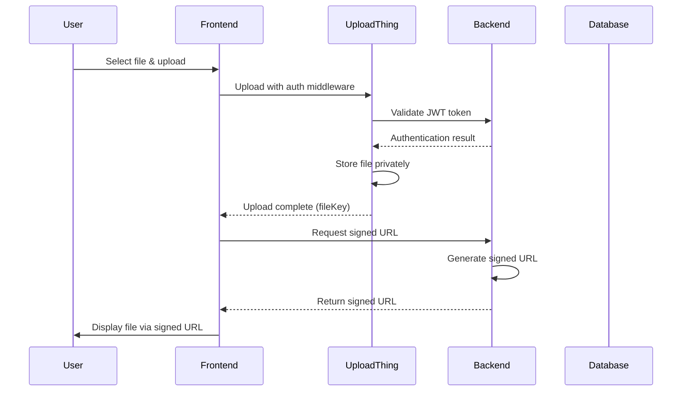

# UploadThing Integration Documentation

## Overview

This document describes the UploadThing integration for handling private file uploads and secure access in the fundifyhub application. The implementation supports private file storage with signed URL generation for temporary access.

## Architecture

### Components

1. **Frontend Upload Component** (`AssetUpload.tsx`)
   - Handles file selection and upload UI
   - Generates signed URLs for private file display
   - Implements caching and error handling

2. **UploadThing Configuration** (`uploadthing.ts`)
   - Defines file routes with authentication middleware
   - Validates JWT tokens before allowing uploads
   - Configures private file storage

3. **Backend API Controllers** (`controllers.ts`)
   - Generate signed URLs for file access
   - Handle bulk URL generation
   - Manage document metadata

4. **Utility Functions** (`uploadthing.ts`)
   - Core signed URL generation logic
   - File deletion utilities
   - File information retrieval

## File Upload Flow



## API Endpoints

### File Upload

**Route:** `POST /api/uploadthing`
**Authentication:** JWT token (header/cookie)
**Description:** Upload files through UploadThing with authentication

**Request:**
- File data (multipart/form-data)
- Authorization header or accessToken cookie

**Response:**
```json
{
  "fileKey": "file_123456789",
  "uploadedBy": "user_123",
  "fileName": "document.pdf",
  "fileSize": 1024000,
  "fileType": "application/pdf"
}
```

### Generate Signed URL by File Key

**Route:** `GET /api/v1/documents/signed-url-by-filekey/:fileKey`
**Authentication:** None (public endpoint for signed URL access)
**Description:** Generate signed URL for direct file access

**Parameters:**
- `fileKey` (path): UploadThing file key
- `expiresIn` (query, optional): Expiration time in seconds (default: 900)

**Response:**
```json
{
  "success": true,
  "data": {
    "url": "https://app.ufs.sh/f/file_123?signature=...",
    "expiresAt": "2025-11-09T12:15:00.000Z",
    "expiresIn": 900,
    "fileKey": "file_123"
  }
}
```

### Generate Signed URL by Document ID

**Route:** `GET /api/v1/documents/:id/url`
**Authentication:** Required (JWT token)
**Description:** Generate signed URL for document by database ID

**Parameters:**
- `id` (path): Document database ID
- `expiresIn` (query, optional): Expiration time in seconds (default: 900)

**Response:**
```json
{
  "success": true,
  "data": {
    "url": "https://app.ufs.sh/f/file_123?signature=...",
    "expiresAt": "2025-11-09T12:15:00.000Z",
    "expiresIn": 900,
    "document": {
      "id": 123,
      "fileName": "document.pdf",
      "fileSize": 1024000,
      "fileType": "application/pdf"
    }
  }
}
```

### Bulk Signed URLs

**Route:** `POST /api/v1/documents/signed-urls`
**Authentication:** Required (JWT token)
**Description:** Generate signed URLs for multiple documents

**Request Body:**
```json
{
  "documentIds": [123, 456, 789],
  "expiresIn": 1800
}
```

**Response:**
```json
{
  "success": true,
  "data": [
    {
      "id": 123,
      "fileName": "doc1.pdf",
      "fileType": "application/pdf",
      "url": "https://app.ufs.sh/f/file_123?signature=...",
      "expiresAt": "2025-11-09T12:30:00.000Z"
    },
    {
      "id": 456,
      "fileName": "doc2.pdf",
      "fileType": "application/pdf",
      "url": "https://app.ufs.sh/f/file_456?signature=...",
      "expiresAt": "2025-11-09T12:30:00.000Z"
    }
  ]
}
```

## Configuration

### UploadThing Dashboard Setup

For private file support, configure your UploadThing app:

1. Go to UploadThing Dashboard → App Settings
2. Navigate to "Regions and ACL"
3. Set ACL to **"private"**
4. Save changes

### Environment Variables

```env
UPLOADTHING_TOKEN=sk_live_xxxxxxxxxxxxxxxxxxxx
```

### File Router Configuration

```typescript
export const ourFileRouter = {
  assetImageUploader: f({ image: { maxFileSize: "4MB" } })
    .middleware(async ({ req }) => {
      // Authentication logic
      return { userId, userEmail, userRoles, userDistricts };
    })
    .onUploadComplete(async ({ metadata, file }) => {
      // Post-upload processing
      return {
        fileKey: file.key,
        uploadedBy: metadata.userId,
        fileName: file.name,
        fileSize: file.size,
        fileType: file.type,
      };
    }),
};
```

## Security Considerations

### Authentication
- All uploads require valid JWT token validation
- Tokens are checked against backend authentication endpoint
- Failed authentication blocks file uploads

### File Access
- Private files require signed URLs for access
- Signed URLs expire after 15 minutes by default
- URLs include cryptographic signatures for validation

### Data Protection
- Files are stored privately in UploadThing
- No public URLs are exposed
- Temporary access through signed URLs only

## Error Handling

### Upload Errors
- Authentication failures: 401 Unauthorized
- File size/type violations: 400 Bad Request
- Network issues: Retry with exponential backoff

### Signed URL Errors
- Invalid file key: 404 Not Found
- Generation failures: 500 Internal Server Error

## Usage Examples

### Basic File Upload

```tsx
import { AssetUpload } from '@/lib/uploadthing/AssetUpload';

function MyComponent() {
  const handleUploadComplete = (files) => {
    console.log('Uploaded files:', files);
    // Files contain fileKey for signed URL generation
  };

  return (
    <AssetUpload
      onUploadComplete={handleUploadComplete}
      maxFiles={5}
    />
  );
}
```

### Manual Signed URL Generation

```typescript
import { generateSignedUrl } from '@/utils/uploadthing';

const signedUrl = await generateSignedUrl('file_123', 1800);
// URL expires in 30 minutes
```

## Migration Notes

### From Public to Private Files

1. **Upgrade Plan:** Ensure paid UploadThing plan for private files
2. **Dashboard Config:** Set ACL to "private" in UploadThing dashboard
3. **Code Update:** No code changes required - implementation already supports private files
4. **Testing:** Verify signed URL generation works correctly

### Free Plan Limitations

- Free plan only supports public files
- Private file features unavailable
- Signed URL generation will return public URLs

## Performance Optimization

### Signed URL Caching
- Frontend caches signed URLs to avoid duplicate API calls
- Cache keyed by fileKey with automatic expiration
- Concurrent request handling prevents race conditions

### Bulk Operations
- Use bulk signed URL endpoint for multiple files
- Reduces API call overhead
- Maintains consistent expiration times

## Monitoring and Logging

### Key Metrics
- Upload success/failure rates
- Signed URL generation latency
- File access patterns
- Authentication failure rates

### Error Tracking
- UploadThing middleware errors logged
- Signed URL generation failures tracked
- File access errors monitored

## Troubleshooting

### Common Issues

1. **"Authentication required" error**
   - Check JWT token validity
   - Verify token in request headers/cookies

2. **"Failed to load image" in UI**
   - Signed URL may have expired
   - Check network connectivity
   - Verify file exists in UploadThing

3. **Upload fails silently**
   - Check browser console for errors
   - Verify UploadThing app configuration
   - Confirm file size/type limits

### Debug Mode

Enable detailed logging by setting log level to DEBUG in your logger configuration.